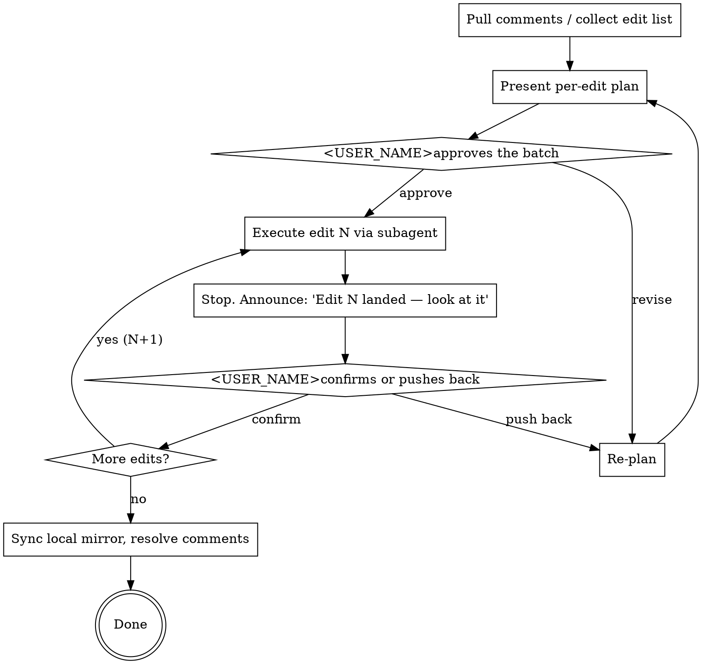

# Pair-Edit

The pair-edit ritual for customer deliverables.

## Roles

- **<USER_NAME>has the live surface open in **Claude in Chrome** (his viewport). He watches each change land.
- **Claude (me)** has **MCP tools via mcporter** on <INFERENCE_HOST>. I do not need Claude in Chrome; that is <USER_NAME>s window.

These roles are fixed. Don't switch them. Don't try to load Claude-in-Chrome tools to "verify" the edit yourself — <USER_NAME>is the verifier.

## When to use

- Customer deliverable in a Google Doc, Notion page, or similar shared surface
- Multiple edits to land (comment resolutions, voice passes, formatting fixes)
- <USER_NAME>wants to see each one before the next
- Anything under <USER_NAME>s name going to a customer

Do NOT use for:
- Internal scratch docs (just edit)
- Single one-shot edits where there's nothing to review one-at-a-time
- Local files (use Edit tool)

## The ritual



## Step-by-step

### 1. Collect the edit list

For Google Docs:
```bash
ssh <INFERENCE_HOST> "mcporter call 'google-workspace.list_document_comments(user_google_email: \"<EMAIL_ADDRESS>\", document_id: \"<DOC_ID>\")'"
```

Filter to OPEN comments only (skip `[RESOLVED]` ones). For each open comment, capture: comment_id, author, timestamp, quoted_text, content.

If the user provides an explicit edit list instead of comments, use that.

### 2. Locate each anchor in the live Doc

Don't trust the local mirror — it may be behind. Pull the live content:
```bash
ssh <INFERENCE_HOST> "mcporter call 'google-workspace.get_doc_content(user_google_email: \"<EMAIL_ADDRESS>\", document_id: \"<DOC_ID>\")'" > /tmp/livedoc.txt
```

For each anchor, grep the live fetch to confirm the exact phrasing (the comment's `Quoted text` is sometimes truncated/encoded). Note which tab the anchor lives in if the doc has tabs.

### 3. Present the per-edit plan

For EACH edit, show:
- Comment ID + author + age
- Anchor (the live-Doc text)
- Diagnosis (what <USER_NAME>the commenter wants fixed)
- Proposed change (find_text → replace_text, or batch_update_doc op)
- Risk note (1 sentence: scope of change, blast radius)

Then ask <USER_NAME>to approve the batch, revise specific items, or reorder.

**Never start executing without explicit approval.** The plan is the contract.

### 4. Execute one edit via the `pair-editor` subagent

Spawn the `pair-editor` subagent (one per edit) with the doc_id, anchor, replacement, and edit_description. The subagent:
- Runs the mcporter find_and_replace_doc / batch_update_doc call
- Verifies "Replaced 1 occurrence(s)" (or matching success signal)
- Returns the result + Doc link

Why a subagent: keeps the mcporter API noise out of the main pair-edit context, isolates one edit per call, gives a clean return surface.

### 5. Stop. Announce. Wait.

After the subagent returns:
```
Edit N landed: <one-line summary>. Look at it in Chrome.
```

That's it. **Do not start the next edit.** Wait for <USER_NAME>to confirm in chat ("yes", "next", "looks good") or push back ("undo", "revise").

If he pushes back, re-plan. Don't argue; he's the visual ground truth.

### 6. Resolve comments

After all edits land and <USER_NAME>approves the final state, resolve each addressed comment:
```bash
ssh <INFERENCE_HOST> "mcporter call 'google-workspace.manage_document_comment(user_google_email: \"<EMAIL_ADDRESS>\", document_id: \"<DOC_ID>\", action: \"resolve\", comment_id: \"<ID>\")'"
```

### 7. Sync local mirror

If the deliverable has a local source-of-truth file (<USER_NAME>s repo), apply the same edits there so the markdown stays aligned with the live Doc. Commit only when <USER_NAME>says ship.

## Hard rules

1. **MCP for me, Chrome for <USER_NAME>Don't try to navigate the Doc in Chrome yourself. Don't ask him to do MCP work. Roles are fixed.
2. **One edit at a time.** Never batch-execute multiple edits without a stop in between, even if they look "small" or "obviously good." <USER_NAME>s review cadence is the value.
3. **Plan before execute.** Every time. The plan is presented in chat; the execution follows approval. No silent edits.
4. **Suggesting mode caveat.** MCP edits land directly (Suggesting-mode toggle is browser-only). Pair-edit is the explicit-approval path that satisfies <USER_NAME>s `feedback_google_docs_suggesting_mode.md` rule for MCP edits — every edit is reviewed in chat before it runs and reviewed in Chrome after it lands.
5. **Verify the replacement count.** "Replaced 1 occurrence(s)" = good. "Replaced 0" = anchor wrong, stop. "Replaced 2+" = unique-ify the find_text and retry. Never claim "done" without the count.
6. **Voice register.** <USER_NAME>s formal customer-facing voice rules (`feedback_lance_voice_formal.md`) apply to the proposed `replace_text`. No em-dashes, no arrows, no analyst tone, no stiff vocab.
7. **Do not mention Suggesting mode unless <USER_NAME>brings it up.** This is the explicit-approval path that replaces it.

## Anti-patterns

- "Let me just fix all four at once, they're related" → no, one at a time
- "I'll execute and then plan retroactively" → no, plan first
- Loading Claude-in-Chrome tools to check the result yourself → no, <USER_NAME>verifies
- "I'll resolve the comment first so it's done" → no, resolve LAST after <USER_NAME>approves
- Bulk-resolving comments before <USER_NAME>has eyeballed each fix → no
- Editing the local mirror before the live Doc → no, live Doc is canonical for deliverables

## Subcommand semantics

- `/pair-edit <doc-id-or-url>` — start a new pair-edit session: pull comments, present plans
- `/pair-edit comments` — re-pull comments on the current Doc (after <USER_NAME>closes some)
- `/pair-edit next` — execute the next approved edit and stop
- `/pair-edit resolve` — resolve all comments addressed in this session
- `/pair-edit status` — show which edits in the plan are done, pending, blocked

## Cross-reference

- `feedback_google_docs_suggesting_mode.md` — the original rule this skill operationalizes for MCP edits
- `feedback_lance_voice_formal.md` — voice rules for the replacement text
- `feedback_kanban_sequential.md` — same one-at-a-time discipline applied to Kanban tickets
- `pair-editor` agent — the subagent that runs each individual edit
